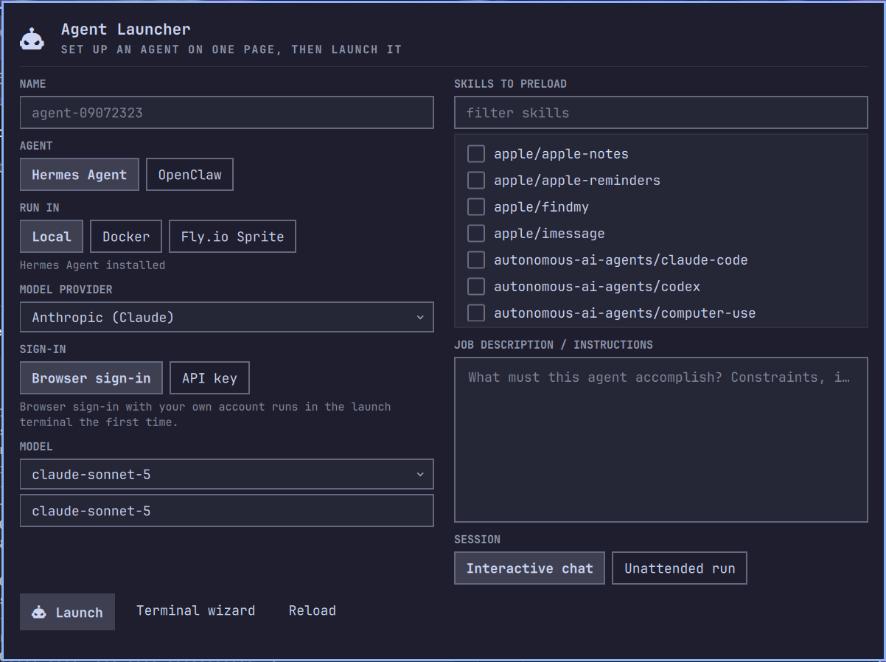

# Omarchy Agent Launcher

**Run AI agents from your desktop, with a chief of staff.** Press a key and the
**Agent Dashboard** opens on **Jarvis**: an agent that runs on your own GPU by
default, knows what every other agent is doing and what it cost, and hands work
to bigger models when you ask. Create and launch agents on one page, see every
agent's status, jump to any chat, follow a sortable event log, and get notified
when an agent needs you. Agents run in a shell on your machine, inside their
official Docker image, or on a [Fly.io Sprite](https://fly.io/sprites); the
models they use can be local, an API or subscription you sign in to, or a vLLM
server on a [Modal](https://modal.com) GPU you choose.



The dashboard is a persistent window (it stays until you close it) with six
pages, switchable with `1`–`6`:

| Page | What it shows |
|------|---------------|
| **Jarvis** | the chief of staff: its state and Chat, a plain status **Brief**, an **Ask Jarvis** box answered by its model, the numbers (prompt and output tokens, USD, total and today), the **backends** work can go to (with the Modal GPU picker), and **every task** with its tokens and cost. |
| **Agents** | every saved agent with a status pill (running / blocked / done / idle), its job, last event, task count, tokens and USD so far, and **Chat**, Stop, Edit job, Remove. Enter or Chat focuses the agent's window or reattaches its session. |
| **New agent** | the one-page setup form (below) |
| **Events** | the event log: filter by agent, task, level, or text; click a column header to sort |
| **Notifications** | open blockers (things that need you) with Chat and Resolve, recent warnings, and the desktop-notification toggle |
| **Projects** | every registered project (`hermes project create`) with its current waterfall phase, percent complete, and open blocker count, read from its bound Hermes kanban board — double-click jumps to Events filtered to that project's agent |

The bar button opens the dashboard; right-click opens a quick agent switcher;
a red badge counts open blockers.

The **New agent** page asks for:

| Step | Choices |
|------|---------|
| **Agent** | [Hermes Agent](https://github.com/NousResearch/hermes-agent) (Nous Research) · [OpenClaw](https://openclaw.ai) |
| **Runtime** | local shell · Docker container · Fly.io Sprite (needs your Sprites API token) |
| **Model** | **Local GPU (offline)**, Anthropic, OpenAI, OpenAI Codex, Nous Portal, xAI, OpenRouter, Gemini, DeepSeek, local Ollama, a **backend endpoint** (a Modal server you deployed from the Jarvis page, or a shared URL), or any custom model id. The list is live: the newest models of each provider with **prices per million tokens**, from the open [models.dev](https://models.dev) catalog |
| **Sign-in** | browser OAuth with your own account (where the agent supports it) or an API key, saved once with mode 600 |
| **Skills** | checkboxes over your installed skill library, plus hub install for Hermes |
| **Job** | the instructions / job description, written in `$EDITOR`, typed inline, or taken from a file |
| **Mode** | interactive chat that starts on the job, or an unattended one-shot run |

Every agent gets **its own isolated home** (config, keys, skills, memory)
under `~/.local/share/omarchy-agent-launcher/agents/<name>/`. Your real
`~/.hermes` and `~/.openclaw` are never written; only their skill libraries
are read so you can pick skills. Saved agents can be
relaunched, edited, or destroyed from the same menu.

**An [omarchy.fans](https://omarchy.fans) project.** Open source under the MIT
license; modpunk is the main contributor. The plugin is free and always will
be: agents run on your own machine, in a container, or on a cloud account you
hold. omarchy.fans will also offer **hosted cloud runtimes** for these agents as
a paid convenience, with the price shown in the setup form before you launch
(see [Hosting](#hosting-your-own-or-omarchyfans-cloud) below).

## Install

```bash
omarchy plugin add https://github.com/OmarchyFans/omarchy-fans-agent-launcher
omarchy plugin enable fans.omarchy.agent-launcher
```

The plugin is not yet listed in the Omarchy plugin marketplace; installing by
URL, as above, is the supported path. `omarchy plugin add` clones the repo into
`~/.config/omarchy/plugins/fans.omarchy.agent-launcher/` and lands it
**disabled** so you can read it first. It runs no code, no installer, no sudo.
Enabling adds a robot button to the bar; clicking it opens the **Agent
Dashboard** window (right click: quick agent switcher). Updating from a
version before 0.5, or from 0.6 to 0.7 (which adds the Jarvis page's QML
files), adds and renames QML files, so run `omarchy restart shell` once after
`omarchy plugin update`.

After an `omarchy plugin update` that adds or renames QML files, run
`omarchy restart shell`: the shell's QML engine caches a plugin folder's type
list, and a stale cache surfaces as a bogus "File name case mismatch" error.

Requirements: Omarchy 4.x, `gum`, `jq` (both ship with Omarchy). Then, per
runtime:

- **local** — the agent itself: `hermes` on PATH (see the Hermes install
  docs) or `openclaw` (`npm install -g openclaw@latest --allow-scripts=openclaw`).
- **docker** — `omarchy install docker`. Omarchy keeps your user out of the
  docker group by default, so the launcher runs `sudo docker` and the
  terminal asks for your password.
- **sprite** — the [Sprites CLI](https://docs.sprites.dev/quickstart/). If the
  CLI isn't signed in yet, the launcher offers `sprite org auth` (browser, your
  Fly.io account) or a pasted API token from <https://sprites.dev/account>,
  stored once in `~/.config/omarchy-agent-launcher/secrets.env` (mode 600).
  A sprite is a persistent Ubuntu 25.10 VM (user `sprite`, home
  `/home/sprite`, Node/Python/git preinstalled) that sleeps when idle and
  keeps its filesystem; you pay for CPU and RAM only while it is awake.

### Keybinding and window rule (recommended)

Plugins cannot ship keybindings, so add one line to `~/.config/hypr/bindings.lua`
(SUPER + ALT + A is unbound by default). It summons the dashboard, so the
widget must be enabled:

```lua
o.bind("SUPER + ALT + A", "Agent dashboard", "omarchy-shell shell summon fans.omarchy.agent-launcher '{}'")
```

The dashboard is a Quickshell window (class `org.quickshell`); Omarchy tiles it
unless you add a rule to `~/.config/hypr/looknfeel.lua`:

```lua
o.window({ class = "^org.quickshell$", title = "^Agent Dashboard$" }, { float = true, center = true, size = { 1180, 760 } })
```

Prefer a terminal? The same setup exists as step-by-step prompts:
`omarchy-agent-launcher --popup new` (also the form's "Terminal wizard" button).

Hyprland reloads on save; verify with `hyprctl configerrors`.

The payload picks the page: `'{"tab":"jarvis"}'` (default), `agents`, `new`,
`events`, `notifications`.

### Omarchy menu entry (optional)

Append the snippet in [`extensions/omarchy-menu.snippet.jsonc`](extensions/omarchy-menu.snippet.jsonc)
to `~/.config/omarchy/extensions/omarchy-menu.jsonc` to get an **Agents**
submenu (new / relaunch / manage) in the Omarchy menu.

### `install.sh` (optional helper)

The repo also carries a small helper that does the optional steps for you,
each only after you confirm: symlink the CLI into `~/.local/bin`, add the
keybinding, add the window rule, add the menu entries. It is not run by
`omarchy plugin add`, and it upgrades an older keybinding line in place.

```bash
~/.config/omarchy/plugins/fans.omarchy.agent-launcher/install.sh
```

## Jarvis, the chief of staff

Jarvis is one more agent, saved as `jarvis` with the role *chief of staff*. What
makes it different is what it is told and what it can reach:

- **It runs on your machine.** By default on the **local GPU** (the llama.cpp
  server of the Omarchy Help plugin, see below): offline, private, $0. Pick any
  other ready backend from the **Runs on** dropdown, or
  `omarchy-agent-launcher jarvis setup anthropic`.
- **It sees the whole fleet.** Inside its session the launcher is on `PATH`, and a
  bundled skill (`skills/jarvis/SKILL.md`, copied into its home) teaches it
  `status --json`, `usage --json`, `backends list`, `delegate`, `result`, `stop`,
  `remove`. Jarvis is a *user* of the same CLI the dashboard uses; there is no
  second control plane.
- **It hands work to bigger models.** `delegate` creates a worker agent on the
  backend Jarvis chooses (a paid API, your ChatGPT or Claude subscription via
  browser sign-in, a Modal GPU endpoint, a sandbox), runs the job unattended in
  its own window, and keeps the output under the worker's home so
  `omarchy-agent-launcher result NAME` (and Jarvis) can read it. Workers carry
  `parent: jarvis`, show "for jarvis" on the Agents page, and roll up in usage.
- **It asks before spending.** Its identity file and skill say so: state the
  backend and price, then wait for a yes, before deploying a Modal GPU or
  delegating to a paid model. You can also tell it to be bolder in its job
  description (`omarchy-agent-launcher job jarvis`).

On the **Jarvis** page: **Chat** opens its window (and sets it up the first
time); **Brief** prints a plain status brief computed from the launcher's own
data, no model call; **Ask Jarvis** sends one question to Jarvis' model and shows
the answer inline. From a terminal:

```bash
omarchy-agent-launcher jarvis                    # chat (sets up on the default backend first)
omarchy-agent-launcher jarvis setup [BACKEND] [MODEL]
omarchy-agent-launcher jarvis brief              # agents, blockers, tokens, USD: plain text
omarchy-agent-launcher jarvis ask "what did today cost, and who is blocked?"
printf '%s\n' "Write release notes for v0.7" | omarchy-agent-launcher delegate --backend anthropic --name notes --task-title "Release notes" --job-stdin
omarchy-agent-launcher result notes              # the worker's output, when it is done
```

Jarvis on a small local model is a real constraint: a 4B model with a 32K
window can read JSON and run commands, but reasons less well than a frontier
model. That is exactly why it delegates. If the local server is too small
(`local-server tune` below), Jarvis warns at setup and the dropdown offers the
other ready backends.

### Backends: where work can go

A **backend** is anything a Hermes agent can talk to. `omarchy-agent-launcher
backends list` shows four kinds:

| Kind | What it is | Cost basis |
|------|-----------|------------|
| **provider** | a row of the provider table: Anthropic, OpenAI, Nous, xAI, … with an API key or **browser sign-in with your own account** (OAuth: ready once any of your agents has signed in; new agents inherit that sign-in); also the local GPU and Ollama | per token (models.dev prices, or Hermes' own estimate) |
| **endpoint** | any OpenAI-compatible `/v1` URL plus key: a Modal endpoint a teammate shares, a team vLLM server, a gateway | per token if you enter a price, else unknown |
| **modal-dedicated** | a **vLLM server we deploy to your Modal workspace** (`modal/vllm_endpoint.py`) on the GPU and count you choose. Scales to zero after the idle window; the first request wakes it | **GPU time**, Modal's per-second price × your GPU count |
| **modal-sandbox** | the same server inside a **Modal Sandbox** (`modal/vllm_sandbox.py`): one isolated container nothing else shares, alive for the lifetime you set (max 24 h) or until you stop it | GPU time from start to stop |

Modal needs its CLI once: `pipx install modal` (or `uv tool install modal`),
then `modal setup` (browser; the Jarvis page has a **Sign in to Modal** button
that runs it in a terminal). The launcher never sees or stores your Modal
token; it only runs `modal deploy`, `modal run`, `modal app stop`, and
`modal sandbox terminate`.

**Add backend** on the Jarvis page (or `backends add`) asks for the kind, an
id, the model (a Hugging Face id; a fit for the VRAM you picked is suggested),
the **GPU** with its price per hour and the **count** (1, 2, 4, 8; the
estimated $/h updates), the idle window, the sandbox lifetime, the context
length, and optional per-token prices. Nothing is billed until you press
**Deploy** (dedicated) or **Start** (sandbox) on the row: that opens a terminal
where `modal deploy` builds the image and downloads the weights (minutes the
first time; weights are cached in a Modal Volume). The endpoint URL is recorded,
a random API key protects the server, **Test** calls `/v1/models`, **Stop**
stops the app or terminates the sandbox. Set `HF_TOKEN` in
`~/.config/omarchy-agent-launcher/secrets.env` for gated models.

GPU prices (USD per GPU-hour, from [modal.com/pricing](https://modal.com/pricing)
as read on 2026-09-08; Modal bills per second; `omarchy-agent-launcher modal gpus`):

| GPU | VRAM | $/h | GPU | VRAM | $/h |
|-----|------|-----|-----|------|-----|
| T4 | 16 GB | 0.59 | A100-80GB | 80 GB | 2.50 |
| L4 | 24 GB | 0.80 | RTX-PRO-6000 | 96 GB | 3.03 |
| A10 | 24 GB | 1.10 | H100 | 80 GB | 3.95 |
| L40S | 48 GB | 1.95 | H200 | 141 GB | 4.54 |
| A100-40GB | 40 GB | 2.10 | B200 · B300 | 180 · 288 GB | 6.25 · 7.10 |

Agents on a backend endpoint are ordinary Hermes agents: their home gets
`model.provider: custom`, the backend's URL as `base_url`, the backend's
context length, and the backend's key as `OPENAI_API_KEY` in the agent's own
mode-600 `.env`. The New agent page offers **Backend endpoint** as a provider
with a dropdown of your saved backends.

### Tokens and cost, total and per task

Every Hermes agent home keeps a SQLite session store in which Hermes records,
per session, the provider's real usage: input, output, cache-read, cache-write
and reasoning tokens, plus Hermes' own cost estimate. The launcher reads it
**read-only** and shows:

- **Totals** (Jarvis page tiles, sidebar, `usage`): prompt tokens, output tokens,
  USD, and the same for today. **Prompt = input + cache read + cache write**, the
  way providers bill it; the tile shows the split.
- **Per agent** (Agents page rows, `usage`): tokens, USD, session count.
- **Per task** (Jarvis page table, `usage`): **a task is one agent session**
  (Hermes titles them); a delegated worker is one task whose sessions roll up.
  Sort by any column, filter by agent.

Each row carries a **cost basis** so a dollar figure is never a mystery:
`actual` (the provider reported it) · `hermes estimate` · `hermes estimate (plan)`
(a subscription sign-in: what it *would* cost, covered by your plan) ·
`models.dev` (catalog prices × tokens) · `backend price` (the per-token price you
entered) · `GPU time (est.)` (Modal dedicated: session duration × GPU price;
idle scale-down time is not counted) · `sandbox GPU time (on the backend)`
(sandboxes are billed start to stop, shown on the backend row and in the total) ·
`local GPU · $0` · `unknown`. OpenClaw keeps no comparable store; its agents show
no usage. Sessions Hermes archived are skipped.

```bash
omarchy-agent-launcher usage            # totals, per agent, per task
omarchy-agent-launcher usage --json     # {totals, agents, tasks, backends}
```

## Use

Press the key (or click the bar button). On **New agent**, fill in the page
and click **Launch**: the profile is saved, the agent's home is provisioned,
and its window opens with the session (and the browser sign-in, the first
time). The dashboard switches to **Agents**, where the new row shows its
status; **Chat** brings its window back at any time. Esc closes the dashboard,
`j`/`k` move, Enter opens the selected agent's chat, `r` refreshes.

From a terminal:

```bash
omarchy-agent-launcher                # menu
omarchy-agent-launcher new            # the form
omarchy-agent-launcher launch NAME    # open (or focus) the agent's window and start it
omarchy-agent-launcher chat NAME      # same; reattaches to a running session
omarchy-agent-launcher manage         # show / edit job / sign in / remove / destroy
omarchy-agent-launcher list | show NAME | job NAME | sign-in NAME
omarchy-agent-launcher remove NAME    # forget + delete its local home
omarchy-agent-launcher destroy NAME   # also remove its container / sprite
omarchy-agent-launcher stop NAME      # end the session (the saved agent stays)
omarchy-agent-launcher switch         # graphical picker: jump to an agent's chat
omarchy-agent-launcher status --json  # every agent with status, window, blockers, tasks
omarchy-agent-launcher --dry-run launch NAME   # print every command, run nothing
omarchy-agent-launcher --inline launch NAME    # session in this terminal, not a new window
omarchy-agent-launcher jarvis | usage | delegate … | result NAME | backends … | modal …   # see "Jarvis" above
```

### Sessions persist

Every agent runs inside a **tmux session** (`oal-<name>`) shown in a terminal
window titled `Agent · <name>` with app-id `org.omarchy.agent`, the class
Omarchy's own `omarchy agent` uses, so your window rules apply. That gives you:

- **A chat window that survives.** Close the window, switch workspaces, log
  out of the terminal: the agent keeps running. **Chat** in the panel (or
  `omarchy-agent-launcher chat NAME`) focuses the window if it is open,
  otherwise opens a new one reattached to the same conversation.
- **Sign-in that can't be lost.** The browser sign-in prompt lives in that
  session too. Go to the browser, copy the code, come back through the bar
  button and Chat: the prompt is still waiting for the code.
- **No vanishing windows.** When the agent exits, the window shows a menu:
  continue chatting (the agent resumes its latest conversation), run the job
  again, or close. After an unattended run, "chat" opens a conversation
  that already contains the run.

Each agent's session runs on **its own tmux server**, on the socket
`~/.local/state/omarchy-agent-launcher/tmux/oal-<name>.sock`, not on your
default tmux server. So `tmux ls` does not list agents, nothing else that uses
tmux can kill one by name, and (with Omarchy's `detach-on-destroy off`) an
agent's window can never be switched over to another agent's session. To attach
by hand: `tmux -S ~/.local/state/omarchy-agent-launcher/tmux/oal-<name>.sock attach`.
If a session is killed from outside anyway, the dashboard shows a blocker
saying so, and Chat starts it again.

Without tmux the session still runs, just without the reattach behaviour
(`omarchy pkg add tmux`).

## How each combination runs

| | local | docker | sprite |
|---|---|---|---|
| **Hermes** | `HERMES_HOME=<home> hermes chat -s <skill>… -q <kickoff>` | `nousresearch/hermes-agent` with `<home>` at `/opt/data`, `HERMES_UID/GID` set | clone pinned to a fixed commit, `pip install -e .`, home uploaded as a tarball, `sprite exec --tty` |
| **OpenClaw** | `OPENCLAW_STATE_DIR=<home> openclaw tui --local` | `ghcr.io/openclaw/openclaw` with `<home>` at `/home/node/.openclaw`, key via `--env-file` | `npm install -g openclaw@<version>`, home uploaded, `sprite exec --tty` |

The job description becomes Hermes' `agent.system_prompt` / OpenClaw's
workspace `AGENTS.md`; the session opens with a short kickoff message.
Browser sign-in runs `hermes auth add <provider> --type oauth` or
`openclaw models auth login --provider <id>` inside the chosen runtime
(with `--no-browser` in containers and sprites, which print a URL to open).

### Events, tasks, and blockers

Everything that happens is appended to
`~/.local/state/omarchy-agent-launcher/events.jsonl` (one JSON object per line,
rotated at 2 MiB): agent created, sign-in required / signed in, session started,
session exited, unattended job done, stopped, removed. Events with
`level: blocker` are things that need you (sign-in, a crashed session, a runtime
that could not be prepared); they are kept in `blockers.json` until cleared and,
unless you turn it off (`omarchy-agent-launcher settings set notify_blockers false`),
sent as Omarchy desktop notifications whose click opens the dashboard.

Agents and hooks can post their own events. Inside a local session the plugin's
`bin` is on `PATH` and `OAL_AGENT` holds the agent's name, so an agent (or a
Hermes hook) can run:

```bash
omarchy-agent-launcher event "$OAL_AGENT" note "Parsed 12 issues" --task triage
omarchy-agent-launcher event "$OAL_AGENT" task_done "Release notes drafted" --task notes
omarchy-agent-launcher event "$OAL_AGENT" blocker "Need the deploy token" --level blocker
omarchy-agent-launcher event "$OAL_AGENT" blocker_cleared "" --key need-the-deploy-token
```

A **task** is the agent's job (first line of the job description), any `--task`
name seen in its events, and, for Hermes agents, the cards on the agent's own
kanban board. `status --json` returns all of it per agent.

### Hermes kanban boards

Hermes Agent keeps a SQLite task board at its home directory. Each launched
Hermes agent has its own isolated home, so it has its own board
(`…/agents/<name>/hermes/kanban.db`). Inside its session the agent can run
`hermes kanban create|complete|block …` (its `HERMES_HOME` is already set) and
the launcher mirrors the board **read-only**: cards appear as tasks, status
changes become events, and a card blocked as `needs_input` or `capability`
becomes a blocker until it is completed. The mirror runs whenever the
dashboard refreshes and when a session ends; it never writes to the board.

### Offline agents on your own GPU

Pick **Local GPU (llama.cpp, offline)** as the provider and the agent talks
only to the llama.cpp server on `127.0.0.1` that the Omarchy local agent runs
(the [Omarchy Help](https://github.com/OmarchyFans/omarchy-fans-help) plugin's
`omarchy-local-agent.service`). Nothing leaves the machine: unplug the network
and the agent keeps working. This is the privacy path: a local model cannot
leak your files, keys, or prompts to anyone, and as small models and GPUs
improve it becomes the default way to keep an Omarchy desktop private.

What the launcher does for you:

- discovers the server's URL from `~/.config/omarchy-local-agent/config.json`,
  its loaded model, its context per request, and the GPU (`omarchy-agent-launcher local-server status`);
- starts the service if it is down when you launch a local agent;
- configures Hermes through its LM Studio code path with the server's **real**
  context window (Hermes otherwise insists on 64K) and a placeholder key;
- shows readiness in the New agent page under the provider.

**One thing you must do once.** The help plugin starts llama-server with an 8K
context split over four slots, i.e. 2K tokens per request; a Hermes request is
about 12K tokens. Raise it with:

```bash
omarchy-agent-launcher local-server tune --ctx 32768          # 1 slot, 8-bit KV cache
omarchy-agent-launcher local-server tune --ctx 24576 --kv q4_0 # smaller GPUs
omarchy-agent-launcher local-server untune                    # back to the plugin's own settings
```

`tune` writes a systemd drop-in for `omarchy-local-agent.service`
(`~/.config/systemd/user/omarchy-local-agent.service.d/agent-launcher.conf`)
and restarts it; the help plugin keeps working with the larger window. Fitting
guide for a 4 GB GPU with a 4B Q4 model: 32K with `q8_0` KV is about 3.5 GB;
if the server fails to come up, use `--kv q4_0` or a smaller `--ctx`. A 27B
model does not fit next to a large context on 4 GB. `--model FILE` picks another
`.gguf` from the local agent's models folder.

The help plugin's service currently serves Qwen3.5-4B, chosen by navigation
accuracy on held-out manual questions; the launcher shows whatever the server
serves, and `--model FILE` overrides it for the tuned drop-in.

OpenClaw is pointed at the same server through `OPENAI_BASE_URL`; that path is
untested.

### Models and prices

The model dropdown lists each provider's newest tool-capable models with
input and output prices in USD per million tokens, taken from the open
[models.dev](https://models.dev) catalog (`https://models.dev/api.json`,
fetched at most once a day into `~/.cache/omarchy-agent-launcher/models.json`,
never with your keys). Subscription sign-ins (ChatGPT, xAI browser sign-in,
Nous Portal) show no prices because the plan covers usage; Ollama lists what
`ollama list` reports. Offline, the static suggestions in
[`lib/providers.sh`](lib/providers.sh) are used. "Custom model id…" is always
offered for anything not listed. Set `OAL_MODELS_LIMIT` to change how many
models are shown (default 14).

## Hosting: your own, or omarchy.fans cloud

Everything in this repository runs on infrastructure you control:

| Runtime | Who pays whom | What you need |
|---------|---------------|---------------|
| **local shell** | nobody | the agent CLI installed |
| **Docker** | nobody | `omarchy install docker` |
| **Fly.io Sprite** | you pay Fly.io directly | your own Sprites API token |
| **omarchy.fans cloud** (coming) | you pay omarchy.fans | an omarchy.fans account |

The hosted runtime is the convenience option: sign in once with your
omarchy.fans account, pick it in the setup form next to the others, and the
machine is provisioned, metered, and billed by omarchy.fans. The price per hour
is shown on the form before you launch, the chat window and the dashboard work
exactly as they do for the other runtimes, and `destroy` removes the machine
and stops the meter. Which suppliers omarchy.fans builds on is its own
business; what you get is a machine run under omarchy.fans' terms and
privacy policy, which will be linked from the form. The adapter for it will
live in this repository like the others (`lib/runtimes/`), so you can read
exactly what leaves your machine. Nothing about the free runtimes changes.

## What has been tested

Built on Omarchy 4.x with Hermes Agent 0.21 installed locally.

- ✅ Usage aggregation: checked against a real agent's Hermes session store (two sessions, 1.78M prompt tokens of which 1.5M cache reads, $1.28 Hermes estimate) and a fixture store in `tests/run.sh` (prompt = input + cache, archived sessions skipped, cost basis labels, per-agent figures in `status --json`).
- ✅ Backends registry: add / list / remove, generated keys, endpoint agents provisioned with `provider: custom` + `OPENAI_API_KEY`; `create --backend`; refusing to launch on an undeployed Modal backend.
- ✅ Jarvis: setup, SOUL and bundled skill in its home, `-s jarvis` preload, `delegate` (parent, role, task title, launch), `delegate --wait` and `result` (ANSI stripped), `jarvis brief`, workers in `status --json`.
- ⚠️ **Modal** is written against Modal's documented CLI and Python API (`modal deploy`, `modal run`, `Sandbox.create` with `encrypted_ports`, `Function.from_name(...).get_web_url()`) and verified in `--dry-run` plus `py_compile` only: **no Modal account was available** on the development machine. vLLM is installed unpinned in the image; set `OAL_VLLM_VERSION` to pin. Treat the Modal paths as beta and report what breaks.
- ⚠️ The Jarvis page and the backend form were written to the same Quickshell contract as the other pages but not opened in a live shell during this version. The endpoint path (Hermes `custom` provider against a backend URL) is verified at the config level only, not against a live server.
- ✅ Browser sign-ins are inherited: a new Hermes home for a provider some other home is already signed in to copies that home's `auth.json` (fixture test), so delegated workers and Jarvis never wait on a sign-in prompt nobody is watching. `backends list` calls an OAuth provider ready only when such a sign-in exists.

- ✅ The dashboard: loads in the shell, persists when focus moves elsewhere, all four pages render with live data; Stop, Chat, Resolve, and the blocker badge were exercised.
- ✅ Kanban mirror: fixture board → tasks in `status --json`, blocker on a `needs_input` card, idempotent re-sync, blocker cleared when the card completes.
- ✅ Persistent sessions: a launched agent's window was killed outright; its tmux session survived and `chat` reopened a window attached to the same running conversation. Opening it twice focuses the existing window instead of duplicating it.
- ✅ The setup panel: loads in the shell, reads live data from `info --json`, and renders every control (screenshot above is a real capture). Its Launch path was exercised piecewise: the environment handoff (`Process.environment` overlays, PATH intact) and the no-terminal `create … --launch` branch, which opened the floating launch terminal and surfaced a runtime error there. Keyboard entry into fields follows hyprmoncfg's proven KeyboardPanel pattern but was not typed into by hand.

- ✅ Hermes · local: provisioning, config parsing, per-agent secrets, skill copy + preload, and the request path (verified with a deliberately invalid key that produced the provider's "incorrect API key" error).
- ✅ Hermes on the **local GPU** provider, end to end and offline: the agent ran on the llama.cpp server (32K context, one slot, 8-bit KV cache on a 4 GB RTX 3050 Ti), executed tools, and kept its cache between turns: about 18 s for the first ~14K-token turn, a few seconds for later ones, ~16 tokens/s generation, 3.5 GB VRAM steady.
- ✅ Every agent × runtime combination in `--dry-run` (command generation).
- ⚠️ Docker, Sprite, and OpenClaw paths are written against the official docs and CLIs but were **not exercised end to end** (no docker group, no Sprites account, OpenClaw not installed here). Treat them as beta; issues and PRs welcome.

## Security notes

- Nothing is downloaded and executed by this plugin on your machine. Sprite
  bootstraps clone Hermes at a **pinned commit** and install OpenClaw from npm.
- API keys and the Sprites token live in
  `~/.config/omarchy-agent-launcher/secrets.env` (mode 600). Each agent home
  receives only the single key it needs. API keys never appear on a command line;
  the Sprites CLI takes its token as an argument once, at `sprite auth setup`.
- `sudo` appears exactly once: `sudo docker …` when Omarchy's
  `omarchy-sudo-docker` says the daemon needs it.
- The dashboard (`Dashboard.qml`, `components/`) only runs the plugin's own
  script (`status --json`, `info --json`, `create … --launch`, `chat`, `stop`,
  `event`, `remove --yes`, `settings`) with argv, never a shell string, and
  tails the event log with `tail -F`. The API key and the job text travel in
  the child's environment, never on a command line; the key is written once to
  the mode-600 secrets file.
- Kanban boards and Hermes session stores are opened with `sqlite3 -readonly`.
  Desktop notifications go through `omarchy-notification-send`.
- Backend keys live in the same mode-600 `secrets.env` as `BACKEND_<ID>_KEY`;
  a Modal server's key is generated locally and reaches Modal as a Modal Secret
  built at deploy time, not baked into the image. Your Modal token stays in
  `~/.modal.toml`, written and read only by the `modal` CLI.
- Jarvis has no powers of its own: it runs the same `omarchy-agent-launcher`
  commands you can, inside a Hermes session that asks before dangerous shell
  commands unless you launch it unattended.

## Remove

```bash
omarchy plugin remove fans.omarchy.agent-launcher
```

Then, if you used them: delete the `o.bind` line from
`~/.config/hypr/bindings.lua`, the window rule from `~/.config/hypr/looknfeel.lua`,
the `agents.*` entries from `~/.config/omarchy/extensions/omarchy-menu.jsonc`,
and the symlink `~/.local/bin/omarchy-agent-launcher` (`./uninstall.sh` does all
four). Event history lives in `~/.local/state/omarchy-agent-launcher/`.
Saved agents and secrets stay in `~/.config/omarchy-agent-launcher/` and
`~/.local/share/omarchy-agent-launcher/` until you delete them; `destroy`
removes remote containers and sprites first.

## Contributing

Issues and pull requests are welcome at
[github.com/OmarchyFans/omarchy-fans-agent-launcher](https://github.com/OmarchyFans/omarchy-fans-agent-launcher).
Run `tests/run.sh` (stubbed UI, no network with `OAL_OFFLINE=1`) before
opening a PR; `omarchy plugin validate .` checks the manifest.

## License

MIT, © 2026 omarchy.fans; main contributor modpunk. External dependencies: gum
(MIT), jq (MIT); at runtime the agents and CLIs you choose (Hermes Agent — MIT;
OpenClaw — MIT; Docker; Sprites CLI).
