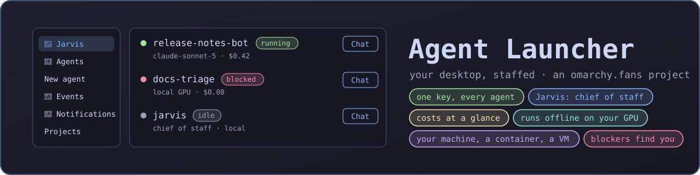
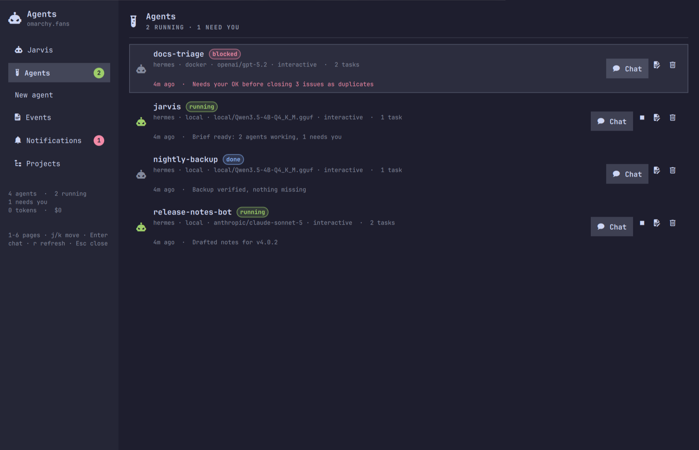
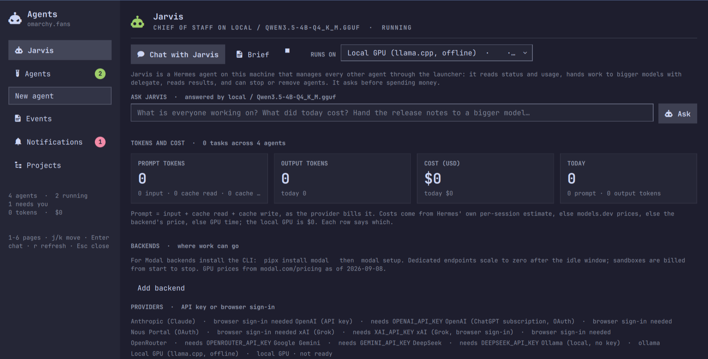
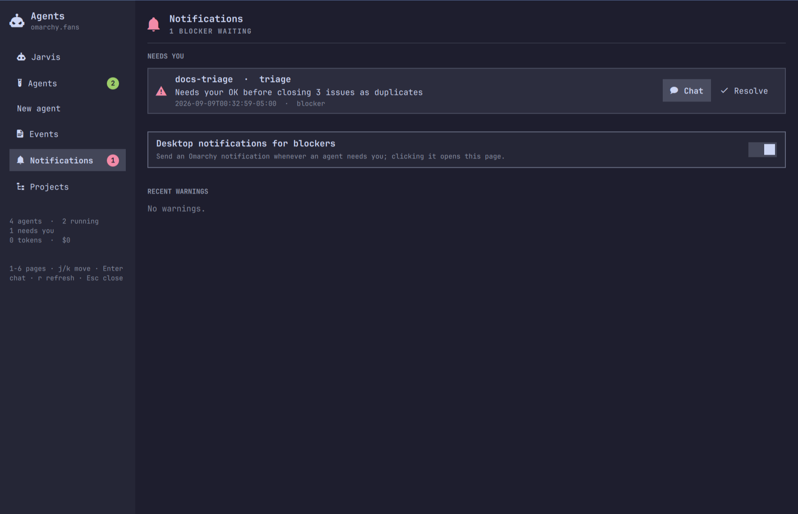

<p align="center">
  
</p>

<h1 align="center">Your desktop, staffed.</h1>

<p align="center">
  <b>One key. A chief of staff named Rix. A team of AI agents that runs for free on your own GPU and calls in the big models only when you say so.</b><br>
  No config files. No accounts to start. Nothing leaves your machine unless you send it.
</p>

<p align="center">
  <code>omarchy plugin add https://github.com/OmarchyFans/omarchy-fans-agent-launcher</code>
</p>

<p align="center">
  
</p>

---

<h2 id="dead-simple-seriously"></h2>

Install the plugin. Press **SUPER + ALT + A**. Rix says hello. That's the setup.

Want an agent of your own? One page, six questions: which agent, where it runs,
which model, how it signs in, which skills, what the job is. Click **Launch**.
No YAML, no dotfiles, no "first configure your environment". If you can fill
in a form, you can run a team.

<h2 id="free-as-in-0"></h2>

Pick **Local GPU** and your agents run on a model that lives on your graphics
card. No API key. No subscription. No meter. Run one agent or ten, all night,
every night: the bill is zero, and it stays zero.

Rix runs there by default, so your chief of staff costs nothing to keep on
duty.

<h2 id="delegate-the-heavy-lifting-to-whoever-you-trust"></h2>

Some jobs deserve a frontier model. Tell Rix, and it hands the task to the
provider you choose: **Anthropic, OpenAI, Grok, Gemini, DeepSeek, OpenRouter**,
your own OpenAI-compatible endpoint, or a GPU server you deploy. It shows you
the model and the price per million tokens first, waits for your yes, and
brings the result back to your desktop with the cost written next to it.

And Rix itself is not chained to your GPU. Run your chief of staff on Claude,
on GPT, on Grok, on anything you can sign in to, and switch whenever you like.
Your agents, your models, your choice, per task.

<h2 id="private-by-design-future-proof-by-choice"></h2>

**Privacy.** A local agent cannot leak what it never sends. Your files, your
keys, your prompts stay on the machine. Every agent gets its own isolated home,
secrets live in a mode-600 file, and the dashboard only ever runs the plugin's
own commands. When you do delegate, you see exactly what goes where, and to whom.

**Future-proofing.** Open-weight models get better every month, and they are
yours to keep: no provider can deprecate them, reprice them, or train on your
data. Build your workflow on agents that run wherever you point them, from your
laptop to a GPU in the cloud, and you will never be held hostage by a pricing
page again.

<h2 id="coming-to-omarchy-fans-cloud-your-own-frontier-gpus"></h2>

Behind the scenes we are building the thing power users keep asking for:
**dedicated GPU endpoints** for the very best open-weight frontier models,
private to you, ready in minutes, billed by the hour with the price on the form
before you launch. Bring your data and **tune the weights** to your work; the
model you shape stays yours. Point Rix at it like any other backend. Same
privacy story as your laptop, with far more horsepower. No accounts to create
until the day you want it; the free runtimes never change.

<h2 id="everything-else-you-get"></h2>

🖥️ **A dashboard that stays.** Every agent with a status pill, its job, last event, tasks, tokens and USD; one click to chat, stop, edit, remove.

📟 **Sessions that refuse to die.** Close the window, switch workspaces, come back tomorrow: the conversation is still there. Sign-in prompts wait for you.

🚨 **Blockers find you.** When an agent needs a decision, it lands in Notifications and as a desktop toast that opens the right page. A red badge on the bar counts what's waiting.

🧾 **Every event, sortable.** Filter by agent, task, or level; click a column to sort.

🧠 **Costs at a glance.** Prompt and output tokens and USD, today and total, per agent and per task, from the agents' own session stores.

🧭 **Projects with a pulse.** Register a project and see its phase, percent complete, and open blockers.

🐧 **Runs where you say.** Your shell. A Docker container. A Linux VM on a cloud account you hold. Soon, omarchy.fans cloud.

🎛️ **Looks like Omarchy.** A Quickshell window drawn with the shell's own tokens, so it wears your theme and switches with it.

<p align="center">
  
  
</p>

**An [omarchy.fans](https://omarchy.fans) project.** Open source, MIT, on GitHub as
[OmarchyFans](https://github.com/OmarchyFans); modpunk is the main contributor.
The plugin is free and stays free. The paid part, when it arrives, is a
convenience: machines and GPUs we run for you, sold under omarchy.fans' terms.

<h2 id="get-it-in-a-minute"></h2>

```bash
omarchy plugin add https://github.com/OmarchyFans/omarchy-fans-agent-launcher
omarchy plugin enable fans.omarchy.agent-launcher
~/.config/omarchy/plugins/fans.omarchy.agent-launcher/install.sh   # optional: keybinding and menu entry (asks first)
```

`omarchy plugin add` clones the repo and lands it **disabled** so you can read
it first. It runs no code, no installer, no sudo. Enabling adds a robot button
to the bar; clicking it opens the dashboard, right-click opens a quick agent
switcher. The plugin is not yet in the Omarchy plugin marketplace; installing by
URL is the supported path. After an update that adds QML files, run
`omarchy restart shell` once.

Then install what your first agent needs:

| You want | You need |
|----------|----------|
| an agent for free, offline | the [Omarchy Help](https://github.com/OmarchyFans/omarchy-fans-help) plugin's local model service, and one `local-server tune` (below) |
| an agent in your shell | [Hermes Agent](https://github.com/NousResearch/hermes-agent) (`hermes` on PATH) or [OpenClaw](https://openclaw.ai) |
| an agent in a container | `omarchy install docker` (the launcher uses `sudo docker`, Omarchy's default) |
| an agent on a cloud VM | that provider's CLI, signed in once; the launcher walks you through it |
| persistent sessions | `tmux` (ships with Omarchy) |

Everything below is the detail. You don't need it to start.

---

## Under the hood

### The dashboard

A persistent window with six pages, switchable with `1`–`6`, `j`/`k` to move,
Enter to open the selected agent's chat, `r` to refresh, Esc to close.

| Page | What it shows |
|------|---------------|
| **Rix** | the chief of staff: its state and Chat, a plain status **Brief**, an **Ask Rix** box answered by its model, the numbers (prompt and output tokens, USD, total and today), the **backends** work can go to, and **every task** with its tokens and cost |
| **Agents** | every saved agent with a status pill (running / blocked / done / idle), its job, last event, task count, tokens and USD so far, and **Chat**, Stop, Edit job, Remove |
| **New agent** | the one-page setup form |
| **Events** | the event log: filter by agent, task, level, or text; click a column header to sort |
| **Notifications** | open blockers with Chat and Resolve, recent warnings, and the desktop-notification toggle |
| **Projects** | every registered project with its waterfall phase, percent complete, and open blocker count; double-click jumps to its events |

### The New agent page

| Step | Choices |
|------|---------|
| **Agent** | Hermes Agent (Nous Research) · OpenClaw |
| **Runtime** | local shell · Docker container · a Linux VM on your own cloud account · omarchy.fans cloud (coming) |
| **Model** | **Local GPU (offline)**, Anthropic, OpenAI, OpenAI Codex, Nous Portal, xAI, OpenRouter, Gemini, DeepSeek, Ollama, a **backend endpoint** (a GPU server you deployed from the Rix page, or a shared URL), or any custom model id. Lists are live from the open [models.dev](https://models.dev) catalog, with prices per million tokens |
| **Sign-in** | browser OAuth with your own account (where the agent supports it) or an API key, saved once with mode 600 |
| **Skills** | checkboxes over your installed skill library, plus hub install for Hermes |
| **Job** | the instructions, written in `$EDITOR`, typed inline, or taken from a file |
| **Mode** | interactive chat that starts on the job, or an unattended one-shot run |

Every agent gets **its own isolated home** (config, keys, skills, memory) under
`~/.local/share/omarchy-agent-launcher/agents/<name>/`. Your real `~/.hermes`
and `~/.openclaw` are never written; only their skill libraries are read.

### Rix, the chief of staff

Rix is your AI orchestrator, the way J.A.R.V.I.S.\* is to Tony Stark.
Before 0.9 it was called Jarvis: the old profile is renamed to `rix` the first
time the launcher runs (stop a running Jarvis session to let it finish), and
`omarchy-agent-launcher jarvis …` keeps working as an alias for one release.

Rix is a Hermes agent the launcher sets up for you (`rix setup`), with a
SOUL that knows the launcher's commands and a bundled skill. It runs on the
local GPU when one is available, so it costs nothing to keep around. From its
page or its chat:

- **Brief**: a plain-language status of every agent, blocker, and today's spend.
- **Ask**: a one-shot question answered by Rix'ss model with the current status as context.
- **Delegate**: `omarchy-agent-launcher delegate --backend NAME --task-title "…" [--wait]` hands a job to a worker agent on a backend; the worker records Rix as its parent, and `result NAME` returns what it produced. Rix proposes the backend and price and waits for your yes before anything that costs money.

**Backends** are where delegated work can go, kept in a registry
(`backends add|list|remove`): the local GPU, any provider you have a key or
sign-in for, any OpenAI-compatible endpoint plus key, or a **vLLM server the
launcher deploys to a GPU cloud account you hold**, as a dedicated endpoint or
an isolated sandbox, with the GPU chosen on the Rix page and its hourly
price shown first. The adapters live in `lib/backends/`; read them before you
rely on them. Keyless providers are refused for delegation.

**Usage and cost** come from the agents' own session stores, read-only:
prompt tokens (input plus cache reads), output tokens, and USD, with the cost
basis labelled (the agent's own estimate, a catalog price, or unknown), per
agent and per task, on the Rix and Agents pages and in `usage --json`.

### From a terminal

```bash
omarchy-agent-launcher                # menu
omarchy-agent-launcher new            # the form
omarchy-agent-launcher launch NAME    # open (or focus) the agent's window and start it
omarchy-agent-launcher chat NAME      # same; reattaches to a running session
omarchy-agent-launcher list | show NAME | job NAME | sign-in NAME
omarchy-agent-launcher stop NAME      # end the session (the saved agent stays)
omarchy-agent-launcher remove NAME    # forget + delete its local home
omarchy-agent-launcher destroy NAME   # also remove its container or cloud VM
omarchy-agent-launcher switch         # graphical picker: jump to an agent's chat
omarchy-agent-launcher status --json  # every agent with status, window, blockers, tasks, usage
omarchy-agent-launcher event NAME KIND "message" [--task T] [--level blocker]   # for hooks and skills
omarchy-agent-launcher rix | usage | delegate … | result NAME | backends …
omarchy-agent-launcher local-server status | tune | untune
omarchy-agent-launcher --dry-run launch NAME   # print every command, run nothing
```

### Sessions persist

Every agent runs inside a **tmux session** on its **own tmux server**
(`~/.local/state/omarchy-agent-launcher/tmux/oal-<name>.sock`), shown in a
terminal window titled `Agent · <name>` with app-id `org.omarchy.agent`, so
your window rules apply. Close the window and the agent keeps running; **Chat**
focuses the window if it is open, otherwise opens a new one attached to the
same conversation. The browser sign-in prompt lives in that session too, so
copying a code from the browser and coming back always works. When the agent
exits, the window offers: continue chatting, run the job again, or close. If a
session is killed from outside, the dashboard raises a blocker and Chat starts
it again. Without tmux everything still runs, just without reattach.

### How each combination runs

| | local | docker | cloud VM |
|---|---|---|---|
| **Hermes** | `HERMES_HOME=<home> hermes chat -s <skill>… -q <kickoff>` | the official `nousresearch/hermes-agent` image with `<home>` mounted | Hermes cloned at a **pinned commit** on the VM, home uploaded as a tarball, session over the provider's exec |
| **OpenClaw** | `OPENCLAW_STATE_DIR=<home> openclaw tui --local` | the official `ghcr.io/openclaw/openclaw` image with `<home>` mounted | OpenClaw installed from npm on the VM |

Browser sign-ins run inside the session (with `--no-browser` in containers and
VMs, which print a URL to open). A new agent home for a provider some other home
is already signed in to inherits that sign-in, so delegated workers never wait
on a prompt nobody is watching.

### Events, tasks, and blockers

Every lifecycle step is appended to
`~/.local/state/omarchy-agent-launcher/events.jsonl` (created, launched,
sign-in required, signed in, session started or exited, job done, stopped,
removed, and `task_*` kinds). Agents and hooks can report their own with
`omarchy-agent-launcher event` (the local runtime exports `OAL_AGENT` and puts
the CLI on PATH). Events at level `blocker` become entries in `blockers.json`,
a red badge, a Notifications row, and a desktop toast whose click opens the
dashboard on that agent. A task is the agent's job, anything reported through
the CLI, or a card on the agent's Hermes kanban board, which the launcher
mirrors **read-only** (`sqlite3 -readonly`): cards become tasks, status changes
become events, a card blocked on you becomes a blocker until it completes.

### Offline agents on your own GPU

Pick **Local GPU (llama.cpp, offline)** and the agent talks only to the
llama.cpp server on `127.0.0.1` that the Omarchy Help plugin runs
(`omarchy-local-agent.service`). The launcher discovers its URL, model, context
per request and the GPU (`local-server status`), starts the service if it is
down, configures Hermes through its LM Studio code path with the server's real
context window, and shows readiness on the form.

**Do this once.** The help plugin's own unit runs an 8K context; a Hermes
request is about 12K tokens. Raise it:

```bash
omarchy-agent-launcher local-server tune --ctx 32768            # 1 slot, 8-bit KV cache
omarchy-agent-launcher local-server tune --ctx 24576 --kv q4_0   # smaller GPUs
omarchy-agent-launcher local-server untune                      # back to the plugin's own settings
```

`tune` writes a systemd drop-in and restarts the service; the help plugin keeps
working with the larger window. The drop-in also runs the server with
`--reasoning off`: with thinking on, a tight `max_tokens` is spent entirely on
hidden reasoning and the reply comes back empty. Re-run `tune` after upgrading
to pick it up. On a 4 GB GPU with a 4B model, 32K with `q8_0`
KV cache is about 3.5 GB. Measured with Hermes: about 18 s for the first
~14K-token turn, a few seconds for later ones thanks to prefix caching, ~16
tokens/s generation. The launcher shows whatever model the server serves.

### Models and prices

The model dropdown lists each provider's newest tool-capable models with input
and output prices in USD per million tokens from the open
[models.dev](https://models.dev) catalog, fetched at most once a day, never with
your keys. Subscription sign-ins show no prices because the plan covers usage;
Ollama lists what `ollama list` reports; offline, static suggestions are used.
"Custom model id…" is always offered.

### Hosting: your own, or omarchy.fans cloud

| Runtime | Who pays whom | What you need |
|---------|---------------|---------------|
| **local shell** | nobody | the agent CLI installed |
| **Docker** | nobody | `omarchy install docker` |
| **cloud VM** | you pay your provider directly | your own account and its CLI |
| **omarchy.fans cloud** (coming) | you pay omarchy.fans | an omarchy.fans account |
| **omarchy.fans GPU endpoints** (coming) | you pay omarchy.fans by the hour | an omarchy.fans account; open-weight frontier models, private to you, tunable on your data |

The hosted runtime is the convenience option: sign in once with your
omarchy.fans account, pick it on the form next to the others, and the machine
is provisioned, metered, and billed by omarchy.fans, with the price per hour
shown before you launch. The chat window and the dashboard work exactly as
they do for the other runtimes; `destroy` removes the machine and stops the
meter. What it runs on is omarchy.fans' business; what you get is a machine run
under omarchy.fans' terms and privacy policy, linked from the form. Its adapter
will be open in this repository like the others, so you can read exactly what
leaves your machine. Nothing about the free runtimes changes.

### What has been tested

Built on Omarchy 4.x with Hermes Agent installed locally.

- ✅ Hermes in the local shell: provisioning, config, per-agent secrets, skills, sign-in inheritance, the request path.
- ✅ Hermes on the **local GPU**, end to end and offline: tools executing, cache reused between turns, 3.5 GB VRAM steady.
- ✅ The dashboard live in the shell: every page renders with real data; Stop, Chat, Resolve, the blocker badge, and the toasts were exercised.
- ✅ Persistent sessions: an agent's window was killed outright; its session survived and Chat reopened a window on the same conversation.
- ✅ Rix: setup, brief, ask, delegate (with and without `--wait`), result, workers in `status --json`.
- ✅ Usage aggregation against a real session store and a fixture; the kanban mirror against a fixture board.
- ✅ Every agent × runtime combination in `--dry-run`.
- ⚠️ Docker, the cloud VM runtime, the GPU-server backends, and OpenClaw were written against their official docs and CLIs but **not exercised end to end** on the development machine. Treat them as beta; issues and PRs welcome.

### Security notes

- Nothing is downloaded and executed on your machine by this plugin. Cloud VM
  bootstraps clone Hermes at a pinned commit and install OpenClaw from npm.
- API keys and cloud tokens live in `~/.config/omarchy-agent-launcher/secrets.env`
  (mode 600). Each agent home receives only the single key it needs. Keys never
  appear on a command line; they travel in the child's environment.
- `sudo` appears exactly once: `sudo docker …`, Omarchy's default for Docker.
- The dashboard runs only the plugin's own script with argv, never a shell
  string, and tails the event log with `tail -F`.
- Task boards and session stores are opened with `sqlite3 -readonly`.
  Notifications go through `omarchy-notification-send`.
- A GPU server's key is generated locally and reaches the server as a
  deploy-time secret, never baked into an image. Your cloud tokens stay with
  their CLIs; the launcher only runs the CLIs.
- Rix has no powers of its own: it runs the same commands you can, inside a
  session that asks before dangerous shell commands unless launched unattended.

### Remove

```bash
omarchy plugin remove fans.omarchy.agent-launcher
~/.config/omarchy/plugins/fans.omarchy.agent-launcher/uninstall.sh   # keybinding, rule, menu entries, CLI symlink
```

Saved agents and secrets stay in `~/.config/omarchy-agent-launcher/` and
`~/.local/share/omarchy-agent-launcher/` until you delete them; `destroy` an
agent first if it has a container or a VM.

## Contributing

Issues and pull requests are welcome at
[github.com/OmarchyFans/omarchy-fans-agent-launcher](https://github.com/OmarchyFans/omarchy-fans-agent-launcher).
Run `tests/run.sh` (stubbed UI, no network with `OAL_OFFLINE=1`) before opening
a PR; `omarchy plugin validate .` checks the manifest.

## License

MIT, © 2026 omarchy.fans; main contributor modpunk. External dependencies: gum
(MIT), jq (MIT); at runtime the agents and CLIs you choose.

\* J.A.R.V.I.S. and Tony Stark are trademarks of Marvel. Omarchy.Fans is not
affiliated with or endorsed by Marvel.
